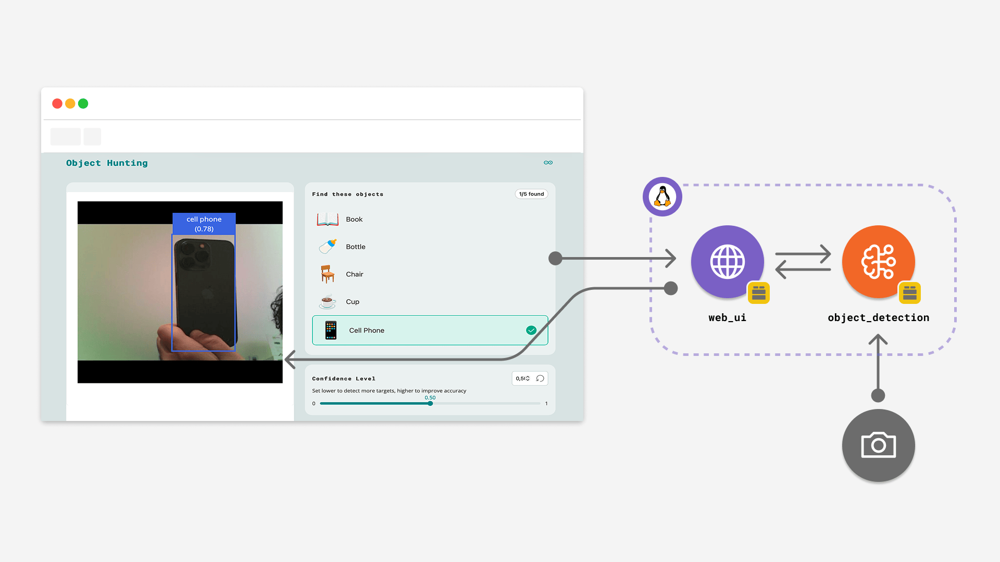
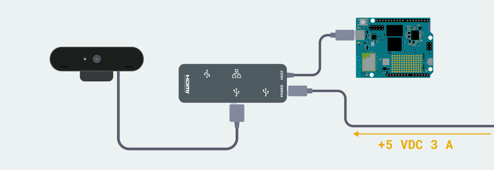

# Object Hunting

The **Object Hunting Game** is an interactive scavenger hunt that uses real-time object detection. Players must locate specific physical objects in their environment using a USB camera connected to the Arduino UNO Q to win the game.

**Note:** This example requires to be run using **Network Mode** or **Single-Board Computer (SBC) Mode**, since it requires a **USB-C® hub** and a **USB webcam**.

*This example is based on the Arduino UNO Q, but also works on Arduino VENTUNO Q.*



## Description

This App creates an interactive game that recognizes real-world objects. It utilizes the `video_objectdetection` Brick to stream video from a USB webcam and perform continuous inference using the **YoloX Nano** model. The web interface challenges the user to find five specific items: **Book, Bottle, Chair, Cup, and Cell Phone**.

**Key features include:**

- Real-time video streaming and object recognition
- Interactive checklist that updates automatically when items are found
- Confidence threshold adjustment to tune detection sensitivity
- "Win" state triggering upon locating all target objects

## Bricks Used

The object hunting game example uses the following Bricks:

- `web_ui`: Brick to create the interactive game interface and handle WebSocket communication.
- `video_objectdetection`: Brick that manages the USB camera stream, runs the machine learning model, and provides real-time detection results.

## Hardware Requirements

### Hardware

- Arduino UNO Q (x1) or Arduino VENTUNO Q (x1)
- **USB-C® hub with external power (x1)** _(only for UNO Q)_
- A power supply (5 V, 3 A) for the USB hub (x1) _(only for UNO Q)_
- **USB Webcam** (x1)

**Important:** A **USB-C® hub is mandatory** for this example to connect the USB Webcam when using the UNO Q.

**Note:** You must connect the USB camera **before** running the App. If the camera is not connected or not detected, the App will fail to start.

## How to Use the Example

1. **Hardware Setup**

   Connect your **USB Webcam** to a powered **USB-C® hub** attached to the UNO Q. Ensure the hub is powered to support the camera.

   

2. **Run the App**

   Launch the App from Arduino App Lab.
   *Note: If the App stops immediately after clicking Run, check your USB camera connection.*

3. **Access the Web Interface**

   Open the App in your browser at `<UNO-Q-IP-ADDRESS>:7000`. The interface will load, showing the game introduction and the video feed placeholder.

4. **Start the Game**

   Click the **Start Game** button. The interface will switch to the gameplay view, displaying the live video feed and the list of objects to find.

5. **Hunt for Objects**

   Point the camera at the required items (Book, Bottle, Chair, Cup, Cell Phone). When the system detects an object with sufficient confidence, it will automatically mark it as "Found" in the UI.

6.  **Adjust Sensitivity**
   
   If the camera is not detecting objects easily, or is detecting them incorrectly, use the **Confidence Level** slider on the right.

   - **Lower value:** Detects objects more easily but may produce false positives.
   - **Higher value:** Requires a clearer view of the object to trigger a match.

7.  **Win the Game**
   
   Once all five objects are checked off the list, a "You found them all!" screen appears. You can click **Play Again** to reset the list and restart.

## How it Works

The application relies on a continuous data pipeline between the hardware, the inference engine, and the web browser.

**High-level data flow:**

```
   USB Camera   ──►   VideoObjectDetection   ──►   Inference Model (YoloX)
                              │                           │
                              │ (MJPEG Stream)            │ (Detection Events)
                              ▼                           ▼
                       Frontend (Browser)     ◄──    WebUI Brick
                              │
                              └──►   WebSocket (Threshold Control)
```

- **Video Streaming**: The `video_objectdetection` Brick captures video from the USB camera and hosts a low-latency stream on port `4912`. The frontend embeds this stream via an `<iframe>`.
- **Inference**: The backend continuously runs the **YoloX Nano** object detection model on the video frames.
- **Event Handling**: When objects are detected, the backend sends the labels to the frontend via WebSockets.
- **Game Logic**: The frontend JavaScript compares the received labels against the target list and updates the game state.

## Understanding the Code

### 🔧 Backend (`main.py`)

The Python script initializes the detection engine and bridges the communication between the computer vision model and the web UI.

- **Initialization**: Sets up the WebUI and the Video Object Detection engine.
- **Threshold Control**: Listens for `override_th` messages from the UI to adjust how strict the model is when identifying objects.

```python
ui = WebUI()
detection_stream = VideoObjectDetection()

# Allow the slider in the UI to change detection sensitivity
ui.on_message("override_th", lambda sid, threshold: detection_stream.override_threshold(threshold))
```

- **Reporting Detections**: The script registers a callback using `on_detect_all`. Whenever the model identifies objects, this function iterates through them and sends the labels to the frontend.

```python
def send_detections_to_ui(detections: dict):
  for key, value in detections.items():
    entry = {
      "content": key,
      "timestamp": datetime.now(UTC).isoformat()
    }
    ui.send_message("detection", message=entry)

detection_stream.on_detect_all(send_detections_to_ui)
```

### 🔧 Frontend (`app.js`)

The web interface handles the game logic. It defines the specific objects required to win the game.

```javascript
const targetObjects = ['book', 'bottle', 'chair', 'cup', 'cell phone'];
let foundObjects = [];

function handleDetection(detection) {
    const detectedObject = detection.content.toLowerCase();
    
    // Check if the detected item is a target and not yet found
    if (targetObjects.includes(detectedObject) && !foundObjects.includes(detectedObject)) {
        foundObjects.push(detectedObject);
        updateFoundCounter();
        checkWinCondition();
    }
}
```

### 🛠️ Customizing the Game

The default model used by the `video_objectdetection` Brick is **YoloX Nano**, trained on the **COCO dataset**. This means the camera can detect approximately 80 different types of objects, not just the five used in this example.

**To change the objects you want to hunt:**

1. **Choose new targets**: You can select any object from the [standard COCO dataset list](https://github.com/amikelive/coco-labels/blob/master/coco-labels-2014_2017.txt) (e.g., `person`, `keyboard`, `mouse`, `backpack`, `banana`).

2. **Update the code**: Open `assets/app.js` and locate the `targetObjects` array:

   ```javascript
   const targetObjects = ['book', 'bottle', 'chair', 'cup', 'cell phone'];
   ```

3. **Replace the items**: Substitute the strings with your chosen object names from the COCO list.

   ```javascript
   const targetObjects = ['person', 'keyboard', 'mouse', 'laptop', 'backpack'];
   ```

4. (Optional) Update `assets/index.html` to change the icons and text displayed in the game introduction to match your new targets.

## Troubleshooting

### App fails to start or stops immediately

If the application crashes right after launching, it is likely because the **USB Camera** is not detected.

**Fix:**

1. Ensure the camera is connected to a **powered USB-C hub**.

2. Verify the hub has its external power supply connected (5 V, 3 A).

3. Reconnect the camera and try running the App again.

### Video stream is black or not loading

If the game interface loads but the video area remains black or shows "Searching Webcam...":

- **Browser Security:** Some browsers block mixed content or insecure frames. Ensure you are not blocking the iframe loading from port `4912`.
- **Network:** Ensure your computer and the UNO Q are on the same network.
- **Camera Status:** If the camera was disconnected while the App was running, you must restart the App.

### Objects are not being detected

If you are pointing the camera at an object but it doesn't register:

- **Check the list:** Ensure the object is one of the targets defined in `app.js`.
- **Adjust Confidence:** Lower the **Confidence Level** slider. If set too high (e.g., > 0.80), the model requires a perfect angle to trigger a detection.
- **Lighting:** Ensure the object is well-lit. Shadows or darkness can prevent detection.
- **Distance:** Move the camera closer or further away. The object should occupy a significant portion of the frame.
