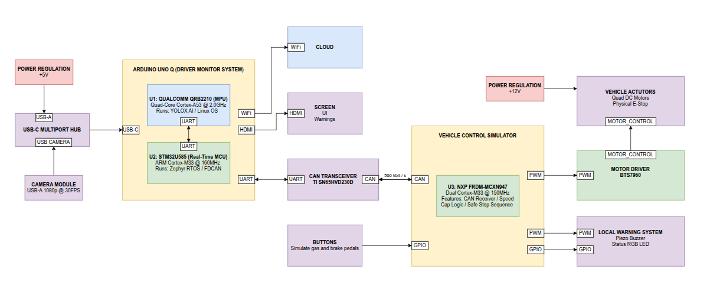
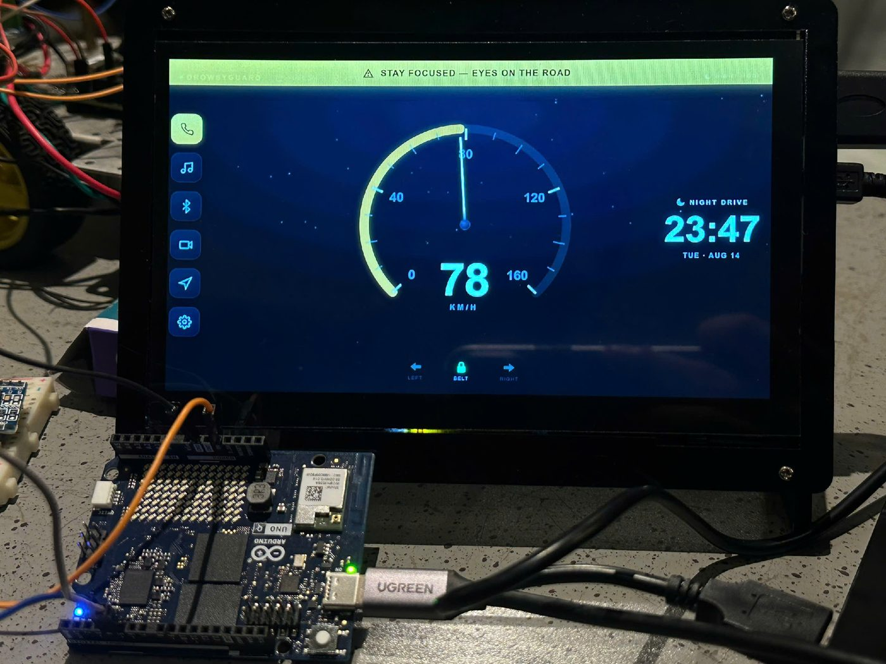
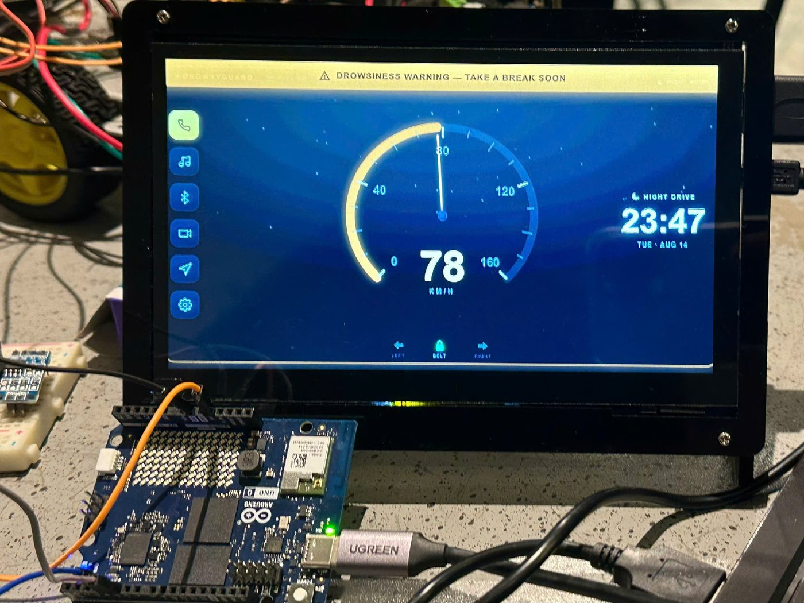
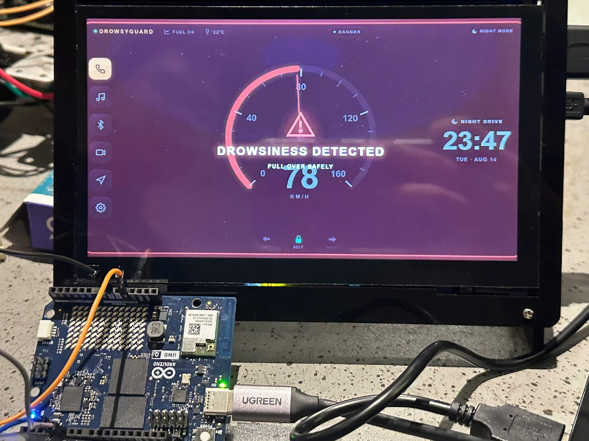
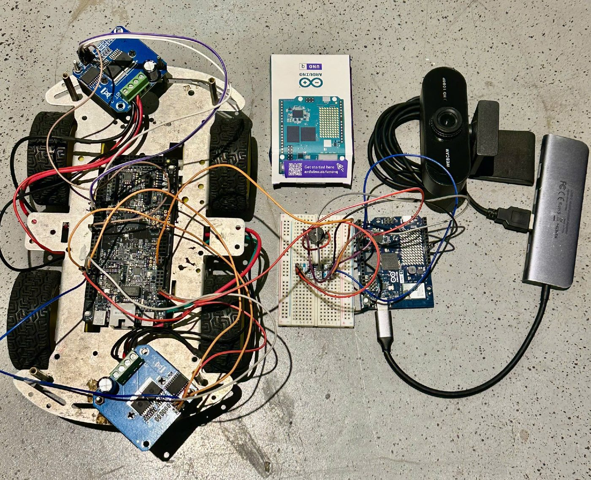
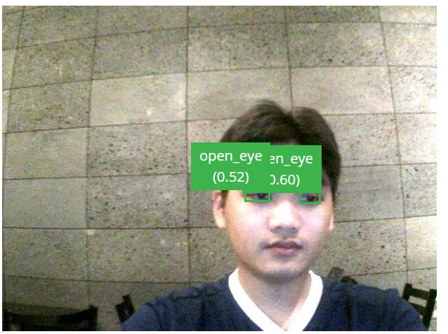
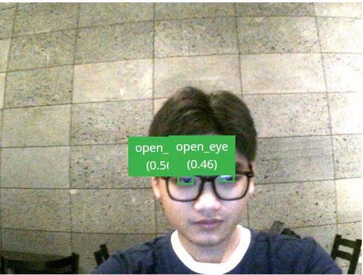
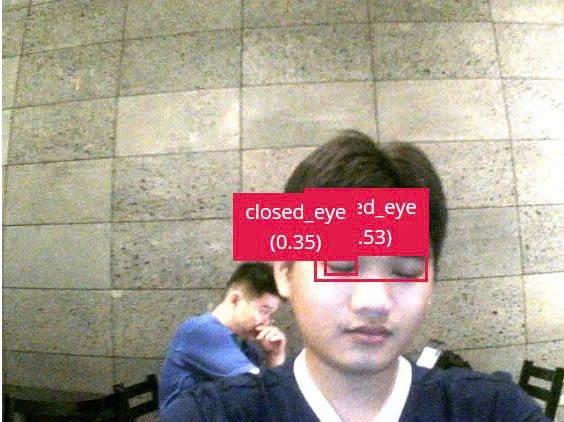
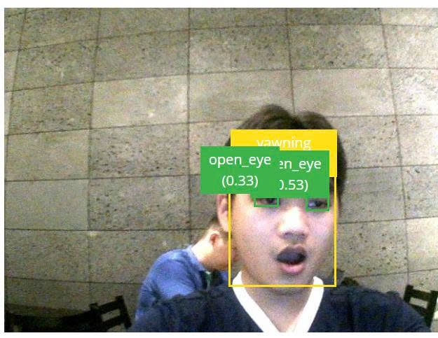

# DrowsyGuard — Edge AI Driver Drowsiness Detection & Vehicle Response

## Table of Contents
- [1. Overview](#1-overview)
- [2. System Architecture](#2-system-architecture)
- [3. Repository Layout](#3-repository-layout)
- [4. Drowsiness Detection & Alert Ladder](#4-drowsiness-detection--alert-ladder)
- [5. Requirements](#5-requirements)
  - [5.1 Hardware](#51-hardware)
  - [5.2 Software](#52-software)
- [6. CAN Bus Protocol (summary)](#6-can-bus-protocol-summary)
- [7. Getting Started](#7-getting-started)
- [8. Demo Output](#8-demo-output)
- [9. Specs & Related Repositories](#9-specs--related-repositories)
- [10. Known Gaps](#10-known-gaps)
- [11. License](#11-license)

## 1. Overview

**DrowsyGuard** is a two-ECU, edge-AI driver-monitoring system built for **Qualcomm Future Makers 2026 — Hack The Challenge** by team **ML_IoT_Love50** (Ho Chi Minh City University of Technology — VNU-HCM).

Drowsy driving is detected on the driver's face and corrected in the vehicle. DrowsyGuard splits those two jobs across a real CAN bus link between two boards:

- 📷 **DMS — Driver Monitoring System** (Arduino® UNO Q, driver-facing camera): runs a YOLOX-Nano detector on-device and fuses signs of drowsiness — eye closure, yawning, distraction — into a four-level alert ladder.
- 🚗 **VCS — Vehicle Control Simulator** (NXP FRDM-MCXN947, 4-motor scale vehicle): reads only that alert level over CAN — caps speed, escalates buzzer/LED alerts, and safe-stops the vehicle at the top level.
- 🌐 **On-device inference, no cloud round-trip**: the alert decision is made on the QRB2210 MPU in the UNO Q; the dashboard UI is just a status mirror.

This repository holds the **firmware and application code** for both ECUs. Design specs, the hackathon presentation, and a separate reference implementation live in a sibling repository — see [Specs & Related Repositories](#9-specs--related-repositories).

> ⚠️ **DrowsyGuard is a research demonstrator.** The scale vehicle is a simulator. No claim of ISO 26262 / ASIL compliance is made.

## 2. System Architecture



```
                          ┌───────────────────────────────────────────┐
                          │   Arduino UNO Q  (AI / MPU + MCU)          │
                          │                                             │
   USB Camera ──────────► │  video_object_detection Brick               │
                          │  (YOLOX Nano: closed_eye/open_eye/yawning)  │
                          │        │                                     │
                          │        ▼                                     │
                          │  main.py  (MPU, Python)                     │
                          │        │ Bridge RPC                          │
                          │        ▼                                     │
                          │  sketch.ino  (MCU)                          │
                          │  alert decision + buzzer + FDCAN1           │
                          └───────────────┬─────────────────────────────┘
                                          │  CAN bus, 500 kbit/s
                          ┌───────────────▼─────────────────────────────┐
                          │   NXP FRDM-MCXN947  (vcs-mcxn947)           │
                          │                                             │
                          │  DMS_STATUS (0x100) → vehicle state machine │
                          │  VCS_STATUS (0x200) → duty%/speed  ─────────┼──► back to UNO Q
                          │        │                                     │
                          │        ▼                                     │
                          │  2× BTS7960 → 4 DC motors (diff. drive)     │
                          │  buzzer + RGB LED alert pattern             │
                          │  gas/brake (onboard SW2/SW3)                │
                          └─────────────────────────────────────────────┘
```

**There are two independent implementations of the UNO Q side**, and this is the single most important thing to know before touching this repo:

- **[`MAIN_DMS_YOLOX_System/copy-of-object-hunting/`](MAIN_DMS_YOLOX_System/copy-of-object-hunting/README.md)** is the real, working camera-driven pipeline. Its `sketch.ino` talks CAN directly to `vcs-mcxn947` (`CANID_DMS_STATUS = 0x100`, `CANID_VCS_STATUS = 0x200`, matching `vcs-mcxn947`'s wire format) using its **own hand-rolled CRC-8 and frame encoding**, not generated from a shared spec.
- **[`dms-ap-uno-q/`](dms-ap-uno-q/README.md)** implements the *same* CAN link using a **formal, documented ICD** (`python/drowsyguard/link/icd.py` + `crc8.py`, mirrored from a shared `icd.yaml`) and a clean `Bridge`/`RouterBridgeTransport` abstraction — but its AI input is currently a keyboard (`KeyboardAlertSource`), not a camera.

They have **not been reconciled**. `dms-ap-uno-q/README.md` explicitly names this as the integration path: swap `KeyboardAlertSource` for a real vision pipeline that needs to feed `ControlLoop` an `icd.AlertLevel` — if `MAIN_DMS_YOLOX_System/` is wired in later, that's the one integration point. Until that happens, only **one** of the two Arduino apps should be flashed and talking to `vcs-mcxn947` on the CAN bus at a time.

## 3. Repository Layout

| Path | Role | Hardware | Status |
|---|---|---|---|
| [`MAIN_DMS_YOLOX_System/copy-of-object-hunting/`](MAIN_DMS_YOLOX_System/copy-of-object-hunting/README.md) | **The actual AI pipeline.** USB camera → [Edge Impulse YOLOX Nano](https://studio.edgeimpulse.com/public/1095447/live) (eye/yawn detection) → alert decision → buzzer + CAN | Arduino UNO Q | Running on real hardware; see its own README for details and known limitations |
| [`dms-ap-uno-q/`](dms-ap-uno-q/README.md) | Reference implementation of the **AP↔MCU Bridge + FDCAN1 + formal ICD** control path, with a **keyboard-driven** stand-in for the AI (`0`–`3` keys) instead of a camera | Arduino UNO Q | CAN link confirmed bidirectional on real hardware |
| [`vcs-mcxn947/`](vcs-mcxn947/README.md) | **Vehicle Control Simulator** — receives `DMS_STATUS` over CAN, runs the vehicle state machine (arm/run/limited/decel/stopped/fault/estop), drives 2× differential-drive motors, buzzer, and RGB LED | NXP FRDM-MCXN947 | Builds clean, flashed and confirmed on real hardware |
| [`dms-sim-mcxn947/`](dms-sim-mcxn947/README.md) | Bench test tool only — plays the DMS-AP side of the CAN link on **real FLEXCAN0** (not a UART shortcut), so `vcs-mcxn947` can be validated with two boards and no Arduino | NXP FRDM-MCXN947 (second board) | Bring-up/test tool, not product firmware |

## 4. Drowsiness Detection & Alert Ladder

The YOLOX-Nano model classifies each face crop as `open_eye`, `closed_eye`, or `yawning`. Three evidence domains feed a four-level alert ladder that both boards agree on over CAN:

| Domain | Trigger |
|---|---|
| **D1 — Distraction** | Head yaw > 30° or pitch-down > 20°, sustained ≥ 2 s |
| **D2 — Yawning** | Mouth-open episodes ≥ 1.5 s, 2+ in a 120 s window |
| **D3 — Eye closure** | Continuous closure at 800 / 1500 / 3000 ms → L1 / L2 / L3 |

| Level | Vehicle-side response |
|---|---|
| **L0** | Silent, green LED, 100% speed |
| **L1** | Soft pulse alert, amber LED, 80% speed cap |
| **L2** | Continuous tone, vibration, fan, 50% speed cap |
| **L3** | Alternating alarm, safe stop in 2.0 s, hazards latched |

The DMS dashboard mirrors the current level in real time:

| L1 — soft warning | L2 — warning | L3 — high alert |
|---|---|---|
|  |  |  |

## 5. Requirements

### 5.1 Hardware

- **Arduino® UNO Q** (Dragonwing QRB2210 MPU + STM32U585 real-time MCU) + USB webcam + powered USB-C hub — driver-facing RGB camera with IR illuminator, 5–50,000 lux
- External CAN transceiver for the UNO Q (e.g. TJA1050) — the UNO Q has no onboard one; see [`dms-ap-uno-q/README.md`](dms-ap-uno-q/README.md) for the exact wiring (D4/D5, level-shifting on RX) confirmed working
- **NXP FRDM-MCXN947** (`vcs-mcxn947`) — dual Cortex-M33 @ 150 MHz, onboard CAN transceiver (J10), FlexCAN + PWM + windowed watchdog
- 2× BTS7960 motor driver modules, 4× TT gear motor (1:48, differential drive), buzzer (≤ 85 dB(A)), RGB status LED, 12 V supply for motors
- A second FRDM-MCXN947, only if using `dms-sim-mcxn947` for bench testing without an Arduino
- 120 Ω CAN termination at each physical bus end

### 5.2 Software

- [Arduino App Lab](https://docs.arduino.cc/software/app-lab/) (for the UNO Q applications) + [Edge Impulse](https://edgeimpulse.com/) (YOLOX Nano model training/deployment: [Edge Impulse Studio Project](https://studio.edgeimpulse.com/public/1095447/live))
- MCUXpresso SDK + [west](https://docs.zephyrproject.org/latest/develop/west/index.html) build tool (Zephyr RTOS toolchain for the FRDM-MCXN947 boards — external, not vendored in this repo)
- Python 3 (for `dms-ap-uno-q`'s Bridge/ICD reference implementation)

## 6. CAN Bus Protocol (summary)

500 kbit/s classic CAN. Full definitions live in the ICD spec (see [Specs](#9-specs--related-repositories)); the frames actually implemented in this repo:

| Frame | ID | Direction | Rate | Payload (summary) |
|---|---|---|---|---|
| `DMS_STATUS` | `0x100` | UNO Q → VCS | 100 ms (fixed, independent of camera FPS) | alert level (0–3), sequence, CRC-8 |
| `VCS_STATUS` | `0x200` | VCS → UNO Q | 100 ms / 10 Hz | `duty_left`/`duty_right` (0–100%, motor PWM) |
| `EMERGENCY_STOP` | — | either direction | on-event, triple-sent | reason code |
| `DMS_METRICS` | — | UNO Q → VCS | on-demand | diagnostic metrics (not currently sent by any app in this repo) |

Vehicle "speed" is **simulated**: `vcs-mcxn947` has no real speed sensor, so both Arduino apps derive a demo km/h figure from `VCS_STATUS`'s motor duty percentage.

## 7. Getting Started

**To run the full working system (camera-driven):**
1. Flash [`vcs-mcxn947/`](vcs-mcxn947/README.md) to the FRDM-MCXN947 (`./build.sh flash`) — see its README for toolchain setup (external MCUXpresso SDK + west, not vendored in this repo).
2. Open [`MAIN_DMS_YOLOX_System/copy-of-object-hunting/`](MAIN_DMS_YOLOX_System/copy-of-object-hunting/README.md) in Arduino App Lab, wire the CAN transceiver, and run.
3. Wire CAN between the two boards (120 Ω termination each end) and open the dashboard at `http://<UNO-Q-IP>:7000`.

**To validate just the CAN link (no camera, no motors):**
- Use `vcs-mcxn947`'s built-in UART command simulator (`./build.sh monitor`, type `l0`–`l3`) — no second board needed at all.
- Or flash [`dms-sim-mcxn947/`](dms-sim-mcxn947/README.md) to a second MCXN947 for a real-FLEXCAN0 bench test.
- Or flash [`dms-ap-uno-q/`](dms-ap-uno-q/README.md) to a UNO Q and drive alert levels from its Python console instead of a camera.

## 8. Demo Output

Bring-up rig — UNO Q + camera/breadboard, dashboard tablet, and the 4-motor scale vehicle:



On-device YOLOX-Nano detections that drive the alert ladder:

| `open_eye` | `open_eye` (glasses) | `closed_eye` | `yawning` |
|---|---|---|---|
|  |  |  |  |

## 9. Specs & Related Repositories

This repository is **not fully self-contained** — several READMEs here reference paths that resolve outside it:

- **`../specs/`** (system requirements, ICD, vehicle-control spec, test plan) and **`../../shared/icd/`** (the canonical `icd.yaml` the CRC/ICD code is meant to mirror) are **not present in this repo**. They live in a separate sibling repository, `QUALCOMM_AI` (note the casing — different from this repo, whose remote is `DrowsyGuard-EdgeAI-HackTheChallenge2026.git`; the sibling's remote is `QUALCOMM_AI_SLIDE.git`), which also holds the Qualcomm Future Makers presentation deck and a nested `DrowsyGuard-EdgeAI-HackTheChallenge2026/` folder containing a more complete reference pipeline (real BlazeFace+CNN inference, `shared/`, its own `specs/`, tests).
- If you're missing `specs/` or `shared/icd/` while reading a README in this repo, that's why — check the sibling repository rather than assuming it's missing by mistake.

## 10. Known Gaps

- The two UNO-Q-side implementations (camera-driven vs. ICD-clean/keyboard-driven) are unreconciled — see [System Architecture](#2-system-architecture).
- VCS-originated `EMERGENCY_STOP` (e.g. a physical e-stop on the vehicle side) has no `Bridge` channel back to Python yet in `dms-ap-uno-q` — it's received over CAN and only logged.
- Vehicle speed is simulated from motor duty%, not measured (`vcs-mcxn947` has no speed sensor).
- Motor current/rail-voltage sensing is not wired on `vcs-mcxn947`, so the stall/undervoltage protections in the vehicle-control spec are currently inert.
- `MAIN_DMS_YOLOX_System/`'s "Camera FPS" UI readout is a configured target, not a live measurement — see that app's own README for why.

## 11. License

SPDX-License-Identifier: MPL-2.0 for the Arduino UNO Q applications (`dms-ap-uno-q/`, `MAIN_DMS_YOLOX_System/`), original template Copyright (C) Arduino S.r.l. and/or its affiliated companies, with substantial modifications. See individual subproject READMEs for specifics.
