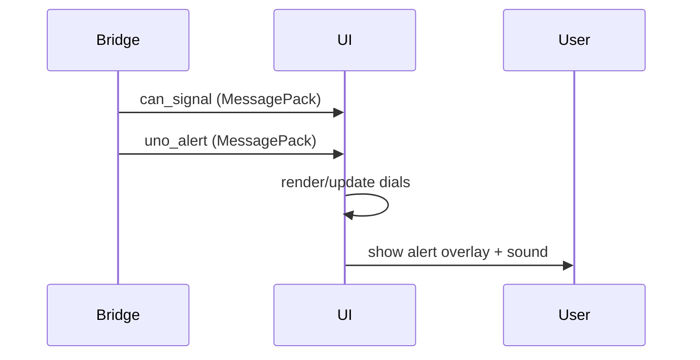

# 09 — UI Dashboard Specification (UI-SPEC-09)

**Document:** DG-SPEC-09 · Rev 0.1 · 2026-08-11 · DRAFT
**Applies to:** DrowsyGuard Desktop Demo (UI + Bridge)

---

## 1. Purpose and scope

### 1.1 Purpose

This document specifies the requirements, architecture, data interfaces and UI behaviour for the
desktop demonstration application that implements a vehicle-style instrument cluster ("car
display") for the DrowsyGuard system. The application is intended for demo and developer use and
must be capable of running with live CAN data, replayed traces, or fully simulated inputs.

### 1.2 Scope — in

- Desktop UI application that renders speedometer, secondary gauge (RPM/HP), odometer, ambient
  temperature, and vehicle indicator icons.
- Realtime reception and rendering of CAN-derived vehicle signals.
- Hard-realtime rendering of alert events produced by the UNO Q node and visualisation of the
  corresponding hardware actions (buzzer, vibration, fan, etc.).
- Developer modes: `live`, `replay`, `simulate` with configurable mapping from the canonical
  ICD (`shared/icd/icd.yaml`).

### 1.3 Scope — out

- This tool is a demonstration/UI product only and does not implement vehicle control logic.
- It shall not be used as a safety controller; the VCS MCU remains the single-source-of-truth for
  safety-critical actuation.

---

## 2. System context

The UI sits alongside a small native bridge service which performs CAN and serial I/O. The
bridge exposes a local WebSocket API consumed by the Electron UI. The diagram below shows the
logical data flows.

```
            +--------------------------+     WebSocket (MessagePack)     +-------------+
            |   bridge (Rust binary)   | <-------------------------------- |  UI (React)  |
            |  - reads CAN adapters     |                                   |  - renders   |
            |  - reads UNO Q serial    | -----> messages: can_signal,      |    dials &   |
            |  - replay / simulate     |        uno_alert, heartbeat,     |    alerts    |
            +-----------+--------------+                                   +------+------+
                        |  CAN frames (live or replay)                            |
                        |                                                      +-v--+
                +-------v------+                                               |Dev| 
                | CAN Adapter  |                                               |Panel|
                +--------------+                                               +----+
```

Also see the sequence overview (mermaid):



---

## 3. Requirements

### 3.1 Functional

- UI-FN-001 — The UI SHALL accept messages of type `can_signal` and `uno_alert` over a local
  WebSocket and update visuals accordingly.
- UI-FN-002 — The UI SHALL provide modes `live`, `replay`, and `simulate` selectable from the
  developer panel.
- UI-FN-003 — The UI SHALL display UNO Q alerts immediately on receipt and visualise `actions`.

### 3.2 Non-functional

- UI-NF-001 — UNO Q alert end-to-end render latency SHALL target ≤ 50 ms typical, worst-case ≤ 100 ms.
- UI-NF-002 — The UI SHALL render smooth dial animation at a configurable rate (default 20 Hz).
- UI-NF-003 — WebSocket binding SHALL default to `localhost` for security.

---

## 4. Message definitions

WebSocket server streams three standardized payload schemas (`ws://<arduino_ip>:8888`):

### 4.1 `camera_frame` — Live Video, Face Mesh & Bounding Boxes (Page 2)

```json
{
  "type": "camera_frame",
  "ts": 1723362945.123,
  "frame_jpeg": "data:image/jpeg;base64,...",
  "image_width": 640,
  "image_height": 480,
  "fps": 10.2,
  "inference_ms": 78,
  "face_detected": true,
  "face_confidence": 0.94,
  "bounding_boxes": {
    "face": { "x": 100, "y": 60, "width": 180, "height": 220 },
    "left_eye": { "x": 120, "y": 95, "width": 45, "height": 25, "closed": false, "ear": 0.32 },
    "right_eye": { "x": 210, "y": 97, "width": 45, "height": 25, "closed": false, "ear": 0.30 },
    "mouth": { "x": 155, "y": 180, "width": 60, "height": 40, "yawning": false, "mar": 0.22 }
  },
  "head_pose": { "pitch": 2.5, "yaw": -1.2, "roll": 0.4 },
  "landmarks": [ { "x": 0.45, "y": 0.32, "z": -0.01 } ]
}
```

### 4.2 `driver_status` — Drowsiness Fusion & Domain Metrics (Page 1)

```json
{
  "type": "driver_status",
  "ts": 1723362945.123,
  "seq": 42,
  "alert_level": 2,
  "alert_name": "DROWSY_L2",
  "d1_state": "ACTIVE",
  "d2_state": "IDLE",
  "d3_state": "SEVERE",
  "d3_available": "AVAILABLE",
  "perclos_pct": 14,
  "perclos_threshold_severe": 15,
  "eye_closure_ms": 1650,
  "eye_closure_threshold_critical": 3000,
  "yawn_count": 1,
  "yawn_threshold_severe": 3,
  "eor_cum_ms": 2200,
  "eor_threshold_severe": 6000,
  "face_conf_pct": 92,
  "sensor_lost_duration_ms": 0,
  "flags": {
    "ack_refractory": false,
    "sensor_lost": false,
    "model_degraded": false,
    "night_mode": false,
    "calib_done": true,
    "ack_saturated": false,
    "pipeline_slow": false
  }
}
```

### 4.3 `vehicle_status` — Vehicle Dynamics & Actuators (Page 1)

```json
{
  "type": "vehicle_status",
  "ts": 1723362945.123,
  "vehicle_state": "RUN",
  "speed_kmh": 68.5,
  "speed_cap_pct": 50,
  "rpm": 2450,
  "odometer_km": 1284.2,
  "duty_left_pct": 50,
  "duty_right_pct": 50,
  "battery_voltage_v": 7.4,
  "logic_supply_v": 5.0,
  "motor_current_a": 0.85,
  "indicators": { "turn_left": false, "turn_right": false, "hazard": false, "headlights": true, "seatbelt": true },
  "actuators": { "buzzer_active": true, "buzzer_freq_hz": 2800, "vibration_active": true, "fan_relay_active": true, "status_led": "RED" },
  "faults": { "driver_fault": false, "watchdog_reset": false, "can_timeout": false, "undervoltage": false, "estop_active": false }
}
```

Notes: MessagePack MUST be used at runtime for compactness and low parsing overhead; the JSON
snippets above are for documentation only.

---

## 5. Signal → Widget mapping (minimum)

- `vehicle.speed_kmh` → Speedometer (left dial, numeric + arc)
- `vehicle.rpm` → RPM / secondary gauge (right dial)
- `vehicle.odo_km` → Odometer (text)
- `vehicle.temp_c` → Temperature indicator
- boolean indicators → Top icon strip (turns, lights, seatbelt)

Mapping rules SHALL be supplied in `config/signal_map.yaml` derived from `shared/icd/icd.yaml`.

---

## 6. Alert behaviour and prioritisation

- Alerts include `level` ∈ {0,1,2,3}. UI SHALL present visual & audio behaviour by level:
  - Level 1: Amber banner (soft beep)
  - Level 2: Red overlay (loud alarm + flash)
  - Level 3: Full-screen modal (repeating alarm) — requires clear from UNO Q or timeout

- If multiple alerts present, UI SHALL surface the highest level; others are retained in the
  alert log accessible from the developer panel.

---

## 7. Performance considerations

- Use a Web Worker to decode MessagePack and forward parsed objects to the UI renderer via
  `postMessage` to avoid blocking the main thread.
- UNO alert messages MUST be processed and enqueued on a high-priority path; they must not be
  dropped due to CAN frame backpressure.
- Bridge SHALL implement bounded CAN queues and drop oldest frames when saturated.

---

## 8. UI layout & visual guidance

- Provide two resolution-aware themes (`theme/light`, `theme/dark`) and scale all canvases by
  `devicePixelRatio` for crisp rendering.
- Use vector assets (SVG) for icons. Speed numeric font size target 48–72px.
- Include accessibility options: high-contrast, large-text, disable-flash.

---

## 9. Developer deliverables

- `config/signal_map.yaml` (mapping file)
- `examples/replay/sample_replay.msgpack` and `examples/alerts/sample_alerts.msgpack`
- Build and run instructions in `README.md` at the project root.

---

## 10. Traceability

This document traces to the top-level system requirements in [01](01-system-requirements.md) and
to the CAN ICD in [04](04-interface-control-document.md).

---

End of UI specification.
